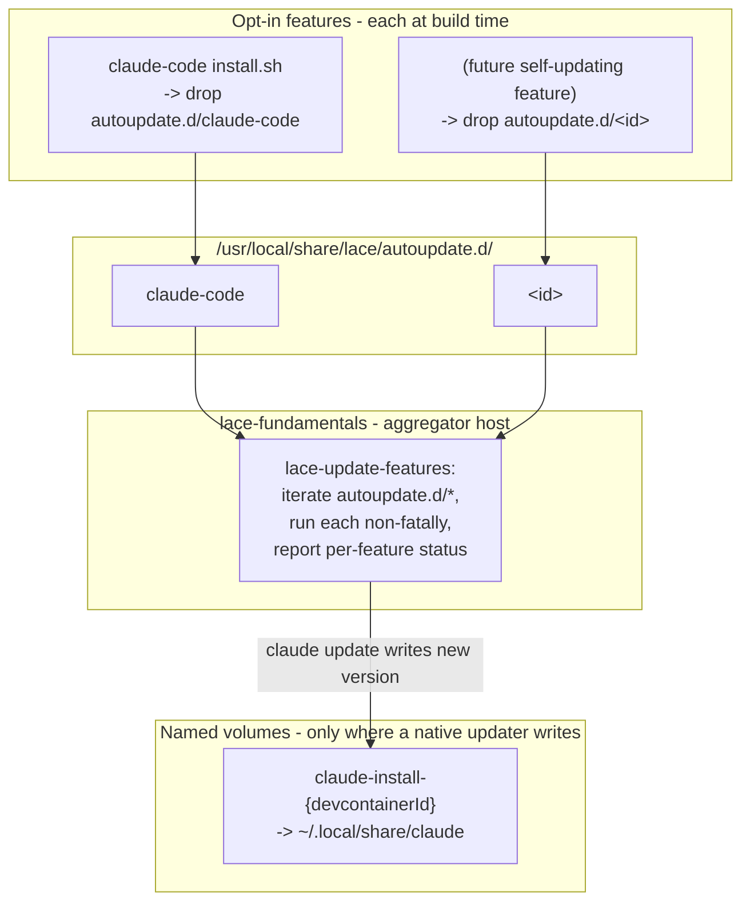

---
first_authored:
  by: "@claude-opus-4-8"
  at: 2026-09-12T15:30:00-07:00
task_list: devcontainer/lace-self-update-cofeature
type: report
state: live
status: review_ready
tags: [devcontainer, auto-update, docker-volume, architecture, future_work]
---

# Cross-Feature Self-Update Framework for lace devcontainer features

> BLUF: The proposed framework generalizes the accepted `claude-code` volume-plus-native-update design into a repo-wide pattern: every opt-in feature ships a standardized `autoupdate` command and is volume-backed, and a `lace-update-features` aggregator runs them all in one shot.
> The pattern is architecturally clean and the discovery mechanism has a strong in-repo precedent (`lace-fundamentals-init` auto-injection), but it generalizes from a sample size of one: of the seven live features, only `claude-code` has a genuine native self-updater, and for `claude-code` the accepted volume design already delivers "it just updates itself" with no aggregator needed.
> For the pinned-binary features (`blesh`, `neovim`), an `autoupdate` command would re-implement, less reproducibly, exactly what the version-sweep pattern already does; `portless` is a hard counterexample where auto-update is actively harmful (its pin is a correctness fix); and three features (`bash-history`, `lace-fundamentals`, `sprack`) have nothing to self-update.
> The entire volume-backing half of the framework is gated on the same unverified go/no-go as the `claude-code` design: whether lace's `devcontainer up --buildkit never` + podman path honors a feature-native named-volume `mounts` entry. If that gate fails, volume-backing is off the table for every feature and the framework collapses.
> Verdict: promising-but-defer. Do not build a cross-feature framework now. Ship the `claude-code` volume design standalone (gated on its go/no-go), and capture the aggregator as a lightweight RFP for the narrow slice that is genuinely useful (a `lace-update-features` convenience wrapper over whatever native updaters exist, today just `claude update`), with the drop-in-dir convention documented so it is cheap to extend if a second self-updating tool ever appears.

## Context / Background

The `claude-code` volume-native-update proposal ([`2026-09-12-claude-code-volume-native-update.md`](../proposals/2026-09-12-claude-code-volume-native-update.md)) was accepted round 2 (held `deferred`, implementation gated on a go/no-go).
It persists Claude Code's native install directory on a per-project named Docker volume and lets the tool's own background updater keep it current across container recreation.

The concept this report explores generalizes that idea to a cross-feature pattern:

1. Each opt-in feature provides a standardized `autoupdate` command and is volume-backed, so its installed tool persists on a named volume and updates survive container recreation.
2. A new `lace-friendly-feature` (user's working name) exposes a `lace-update-features` command that discovers and runs every per-feature `autoupdate` in one shot.

This report analyzes soundness, sketches an architecture, and recommends next steps.
It is deliberately not a full design; that is a follow-up `/cdocs:propose` or `/cdocs:rfp`.

This pattern shares its single load-bearing unknown with the `claude-code` design and with the create-time-hook design ([`2026-09-11-claude-code-feature-updatability.md`](../proposals/2026-09-11-claude-code-feature-updatability.md)): the podman + `--buildkit never` mount/lifecycle passthrough behavior that the legacy-builder saga has repeatedly shown must be verified empirically, not assumed.

## Key Findings

- The framework generalizes from `n=1`. `claude-code` is the only feature with a first-class native self-updater and a user-local install. No other feature ships an updater; for the rest, "autoupdate" would mean writing a bespoke downloader.
- Volume-backing is co-extensive with "has a native self-updater," which today means only `claude-code`. The other features either install system-wide as root (`neovim` to `/usr/local`), are pinned by design, or install nothing to update.
- For `claude-code` specifically, the accepted volume design already delivers the user's literal goal ("it just handles the update automatically") through the tool's own background updater. A `lace-update-features` aggregator adds a manual one-shot on top of a mechanism that is already automatic, so its marginal value for the exemplar is small.
- The discovery mechanism is already solved in-repo. `lace-fundamentals-init` is a build-time script installed to `/usr/local/bin/` that lace auto-injects into `postCreateCommand` by detecting the feature's short id (`up.ts:1019-1064`). A well-known drop-in directory generalizes this cleanly with no per-feature lace-side code.
- `lace-friendly-feature` is net-new (no such feature or command exists in the repo), but its aggregator role is latent in `lace-fundamentals`, which is already the injection and runtime-init hub.
- The shared go/no-go gate is a hard dependency for the whole volume-backing half. If the CLI + podman path does not honor a feature-native named-volume `mounts` entry, volume-backing fails for all features at once.
- The version-sweep pattern ([`2026-09-12-feature-version-update-sweep.md`](../proposals/2026-09-12-feature-version-update-sweep.md)) is the reproducible competitor for pinned-binary features, and it wins on reproducibility for exactly the features an `autoupdate` command would target.

## Feature Inventory: What "Update" Means, and Whether Volume-Backing Helps

Confirmed set of seven live features under `devcontainers/features/src/*`: `bash-history`, `blesh`, `claude-code`, `lace-fundamentals`, `neovim`, `portless`, `sprack`.

| Feature | Install mechanism + location | What "update" means | Native self-updater? | Volume-backing sensible? | Benefits from `autoupdate`? |
|---|---|---|---|---|---|
| `claude-code` | npm/native binary; user-local `~/.local` (per volume design) | `claude update` / background updater | Yes, first-class | Yes (the exemplar) | Yes, but already covered by the volume design's background updater |
| `blesh` | Pinned release tarball to `~/.local/share/blesh` + pinned fzf to `~/.local/bin` | Re-download a newer pinned release | No | Marginal: nothing populates a volume except a re-download | No: pinned for reproducibility; sweep does this deterministically |
| `neovim` | Pinned GitHub release tarball to `/usr/local` (root, system-wide) + tree-sitter via cargo | Re-download a newer pinned release | No | No: installs system-wide as root, not a user dir; plugin state (`~/.local/share/nvim`) is already lace-bind-mounted | No: pinned; sweep does this deterministically |
| `portless` | npm, pinned `0.15.3` | Bump the pin | No | No | No, and actively harmful: `0.15.4` breaks ingress on rootless podman; the pin is a correctness fix |
| `bash-history` | Mount-only; installs no binary | Nothing | No | No (already a bind mount) | No |
| `lace-fundamentals` | Git identity, chezmoi, dotfiles, shell; no external tool | `chezmoi apply` refreshes dotfiles, not a tool version | No | No | No (but is the natural aggregator host) |
| `sprack` | Installs its own hook/metadata scripts + jq | Scripts update via feature republish | No | No | No |

Sources: each feature's `devcontainer-feature.json` and `install.sh`; the sweep proposal's inventory table.

Critical read: only `claude-code` clears the bar the framework is built around.
`blesh` and `neovim` could technically "update" by re-downloading a newer pinned release, but that is precisely what the version-pin plus republish plus relock sweep already does, deterministically and with the running version described by the lockfile.
An `autoupdate` command for them would trade that reproducibility for floating, undescribed versions, which is a regression, not a feature.
`portless` is the sharpest counterexample: its pin exists because the newer version is broken, so a generic auto-updater would reintroduce a known bug.
`bash-history`, `lace-fundamentals`, and `sprack` have no external tool to advance.

## Proposed Pattern / Architecture Sketch

If the framework were built, the natural shape is:

- Discovery via a well-known drop-in directory (`/usr/local/share/lace/autoupdate.d/<feature-id>`), populated by each opting-in feature's `install.sh`.
- `lace-update-features` iterates the directory and runs each script as the remote user, isolating failures.
- The aggregator lives in `lace-fundamentals` (already the runtime-init and injection hub) rather than a net-new `lace-friendly-feature`, avoiding a new feature and a new dependency edge.
- Volume-backing is applied only to features that write their own updates to a user-local dir, which today is only `claude-code` and reuses that design verbatim.

## Design Questions and Options

### Discovery and convention

- Option A, well-known drop-in dir (`/usr/local/share/lace/autoupdate.d/*`): each feature drops a script at build time; the aggregator globs and runs them. Directly mirrors the `lace-fundamentals-init` precedent, needs no lace-side code per feature, and works at runtime in the live container. Recommended.
- Option B, feature metadata (`customizations.lace.autoupdate`): declarative, discoverable without shelling into the container, but requires lace to fetch and process feature metadata and re-inject a command per feature, coupling the aggregator to lace's TypeScript rather than to a runtime convention. More machinery for no clear gain over A.
- Option C, static manifest: a committed list of update commands. Brittle and duplicative; rejected.

Recommendation: Option A. The drop-in dir is the lowest-coupling generalization of the mechanism lace already uses, and it keeps the aggregator a pure shell convention.

### The `autoupdate` command contract

- Naming and location: a single script per feature at `/usr/local/share/lace/autoupdate.d/<feature-id>`, executable, run as the remote user (updates that write to `~/.local` must not run as root).
- Idempotency: safe to run repeatedly; a no-op when already current.
- Offline behavior: exit 0 on no network (an update is best-effort, not a hard dependency), matching the volume design's "failed background update is a non-event."
- Exit-code semantics and non-fatal failure: the aggregator must continue past a failing script and report per-feature status, so one feature's failure never breaks the batch. This is the load-bearing contract detail.

### Volume-backing generalized

- Per-feature volume scoping via `${devcontainerId}`, exactly as the `claude-code` design specifies, to avoid cross-project version coupling and concurrent-write races.
- Same go/no-go mount-passthrough gate (see Risks): shared by every volume-backed feature.
- Drift and reproducibility concerns carry over and multiply: each volume-backed feature moves its version-of-record out of `devcontainer-lock.json` into mutable volume state. The `claude-code` design accepts this as a deliberate single-feature tradeoff; generalizing it multiplies the number of undescribed running versions and the number of orphan volumes (`${devcontainerId}` × features × projects).

### Relationship to the other workstreams

- Create-time npm hook ([`2026-09-11`](../proposals/2026-09-11-claude-code-feature-updatability.md)): a per-feature update-at-create pattern. The aggregator is its runtime analogue (update-while-running instead of update-at-create). They are alternative timings of the same intent.
- Version sweep ([`2026-09-12`](../proposals/2026-09-12-feature-version-update-sweep.md)): the deterministic, reproducible, lockfile-described mechanism. For every pinned-binary feature an `autoupdate` command would target, the sweep is the strictly-more-reproducible option. The framework competes with the sweep on exactly these features and loses on reproducibility.
- No-restart constraint: `lace-update-features` runs in a live container and updates in place; for `claude-code` the new version takes effect on next `claude` start, not on a container restart. This satisfies and arguably exceeds the no-restart constraint (it updates without even a rebuild). That is a genuine point in the pattern's favor, but it is already delivered by the volume design's background updater without any aggregator.

### Value vs complexity

The honest assessment: a whole framework is not justified by the current feature set.
The framework's premise, that many features have a meaningful self-update story, does not hold: exactly one does, and that one is already handled by an accepted design whose background updater makes the aggregator redundant for it.
For the features an `autoupdate` command could plausibly target (`blesh`, `neovim`), per-feature ad-hoc update via the existing version-sweep is both simpler and more reproducible.
Building the framework now optimizes for a future feature population that does not yet exist.

## Risks and Open Questions

Leading with the shared gate:

1. Mount-passthrough go/no-go (GATING, shared with the `claude-code` design). Whether the devcontainer CLI, driving podman on lace's `devcontainer up --buildkit never` path, honors a feature-native named-volume `mounts` entry (with `${devcontainerId}` substitution) is unverified from source. lace passes such an entry through untouched (its mount system is bind-only and never processes feature-embedded `mounts`), so the merge is entirely the CLI + podman's responsibility. This must be tested against podman specifically, not docker: the entire legacy-builder saga exists because the podman path has surprised the project before. If this gate fails, the volume-backing half of the framework fails for every feature simultaneously, and the pattern reduces to "run whatever native updaters exist," which for the current set means only `claude update`.
2. Reproducibility regression, multiplied. Every volume-backed feature moves its running version out of version-controlled config into mutable volume state. What the `claude-code` design accepts as one deliberate tradeoff becomes N undescribed versions across the corpus. The version-sweep exists precisely to keep versions lockfile-described; the framework works against it.
3. Auto-update of pinned tools is a footgun. `portless` is pinned because the newer version is broken. A generic `autoupdate`/floating-version convention risks a feature opting in and silently regressing. Any framework must treat pinning as the default and self-update as a rare, explicit opt-in, which further shrinks its applicability.
4. Volume proliferation and orphan cleanup, scaled. Per-project per-feature named volumes accumulate across jif, whelm, clauthier, weftwise as projects and features churn. Low severity per the `claude-code` design, but it scales with the number of volume-backed features.
5. `neovim`'s install location defeats volume-backing. It installs system-wide to `/usr/local` as root; volume-backing `/usr/local` would shadow unrelated system content, and its user-local state (`~/.local/share/nvim`) is already a lace bind mount. There is no clean volume target.
6. Aggregator-vs-background-updater redundancy. For the one feature that benefits, the background updater already runs. `lace-update-features` would be a manual one-shot layered on an automatic mechanism, so its unique value is a forced "update now" rather than continuous currency.

Open questions for a follow-up:

- Is there a concrete second self-updating tool on the horizon (for example an `opencode` feature, given the deferred [`2026-05-27-opencode-devcontainer-feature.md`](../proposals/2026-05-27-opencode-devcontainer-feature.md)) that would raise `n` above 1 and change this calculus?
- Should the drop-in convention be documented now (cheap) even if the aggregator and volume-backing are deferred, so a future self-updating feature has a landing spot?

## Recommendations

Verdict: promising-but-defer.

1. Do not build a cross-feature self-update framework now. The generalization is premature at `n=1`, and for the pinned-binary features it would regress the reproducibility the version-sweep deliberately preserves.
2. Ship the `claude-code` volume design standalone, gated on its existing go/no-go (condition 2). That design already delivers the user's stated goal for the one feature that benefits, without any aggregator.
3. Capture the aggregator as a lightweight `/cdocs:rfp`, not a full proposal. Scope it to the narrow, genuinely useful slice: a `lace-update-features` convenience wrapper that runs whatever native updaters exist (today only `claude update`), hosted in `lace-fundamentals`, using the Option A drop-in-dir convention (`/usr/local/share/lace/autoupdate.d/*`) with non-fatal per-feature failure isolation. Documenting the convention is cheap and gives a future self-updating feature a place to plug in.
4. Do not mandate volume-backing across features, and do not author bespoke `autoupdate` downloaders for pinned binaries. Keep pinning the default; keep the version-sweep as the reproducible update path for pinned tools.
5. Reassess if `n` rises. If a second feature with a real native updater lands (a plausible candidate is `opencode`), revisit the framework with an actual multi-feature population to justify the abstraction.

> NOTE(opus/lace-self-update-cofeature): This is a research/exploration report, not a decision proposal. The go/no-go verification, the RFP scoping, and the pinning-default policy are calls for the follow-up proposal and overseer, not settled here.
