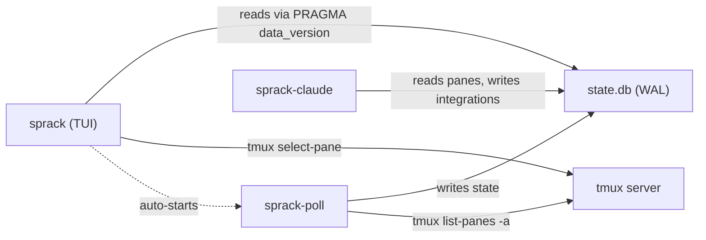

# sprack

A tree-style tmux session browser built as cooperating Rust binaries sharing a SQLite database.
sprack renders a persistent, responsive view of every tmux session, window, and pane as a collapsible tree.
Sessions are grouped by container name using tmux session options.

sprack is read-and-navigate only: it does not create, destroy, or rearrange tmux objects.

## Architecture

Three cooperating Rust binaries share a SQLite database in WAL mode:



| Crate | Role |
|-------|------|
| [sprack-db](crates/sprack-db/) | Shared SQLite library: schema, migrations, typed query helpers |
| [sprack-poll](crates/sprack-poll/) | Daemon: queries tmux state, writes to SQLite, SIGUSR1-driven updates |
| [sprack](crates/sprack/) | TUI binary: responsive tree view, keyboard + mouse input, daemon launcher |
| [sprack-claude](crates/sprack-claude/) | Daemon: reads Claude Code session files, writes structured status |

The SQLite DB is the integration contract: any tool that writes to `process_integrations` gets rendered in the tree.

## Quick Start

### Build

```sh
cd packages/sprack
cargo build --release
```

This produces three binaries in `target/release/`: `sprack`, `sprack-poll`, `sprack-claude`.

### Usage

Run `sprack` in a tmux pane.
It auto-starts `sprack-poll` if it is not already running.

```sh
sprack
```

For Claude Code integration (shows thinking/idle/error status, subagent counts, context usage), start the summarizer separately:

```sh
sprack-claude &
```

The `--db-path` flag overrides the default database location:

```sh
sprack --db-path /tmp/sprack-test.db
```

## Keybindings

| Key | Action |
|-----|--------|
| `j` / `k` | Move cursor down / up |
| `h` | Collapse current node |
| `l` | Expand current node |
| `Space` | Toggle collapse |
| `Enter` | Focus selected node in tmux |
| `q` | Quit |

Mouse: click to select/focus, scroll to navigate, click collapse toggles.

## Configuration

### Database location

Default: `~/.local/share/sprack/state.db`.
Override with `--db-path`.

### tmux hooks for instant updates

> TODO(mjr): Consider if a tmux plugin would be helpful here or overkill, or totally unnecessary when migrating to IPC

sprack-poll uses a 1-second fallback poll interval.
For near-instant structural updates (<50ms), configure tmux hooks to send SIGUSR1:

```tmux
set-hook -g after-new-session    "run-shell 'pkill -USR1 sprack-poll'"
set-hook -g after-new-window     "run-shell 'pkill -USR1 sprack-poll'"
set-hook -g after-kill-pane      "run-shell 'pkill -USR1 sprack-poll'"
set-hook -g session-renamed      "run-shell 'pkill -USR1 sprack-poll'"
set-hook -g window-renamed       "run-shell 'pkill -USR1 sprack-poll'"
```

### PID files

Both daemons write PID files to `~/.local/share/sprack/` (`poll.pid`, `claude.pid`) for single-instance enforcement.

## Development

```sh
# Run all tests
cargo test --workspace

# Clippy lint check
cargo clippy --workspace

# Format check
cargo fmt --all -- --check
```

## Future Work

## Platform Support

Linux is the primary target.
sprack-claude uses `/proc` filesystem walking, which is Linux-specific.
macOS support would require a `libproc`/`sysctl` implementation behind the existing `ProcessResolver` abstraction boundary.
